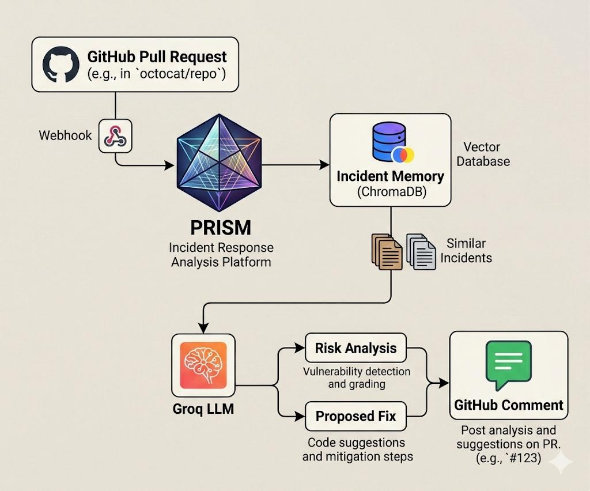
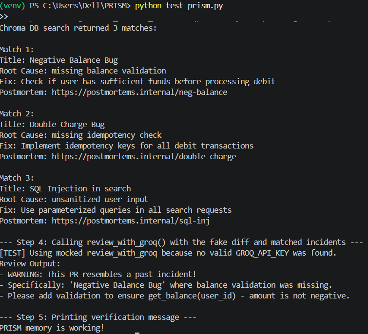
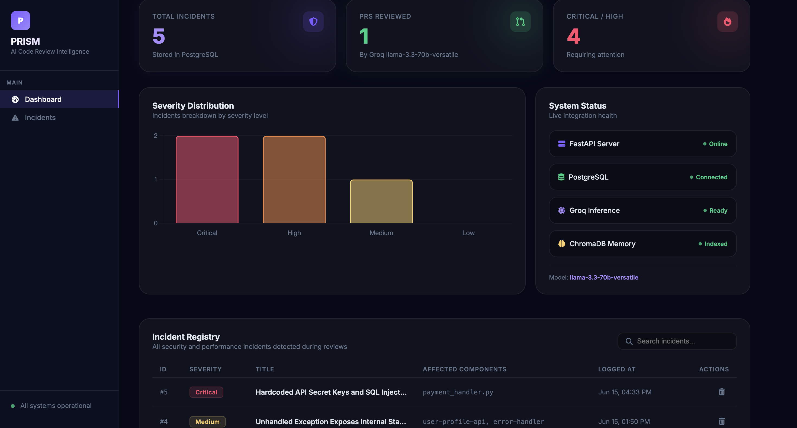
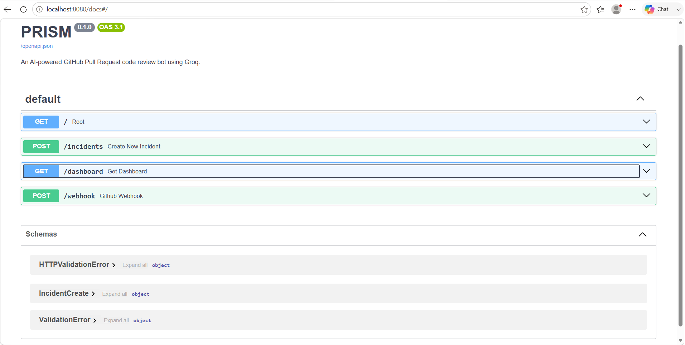

# 🔍 PRISM: AI-Powered Code Review Bot with Incident Memory

> **Catch recurring production bugs before they reach main.** PRISM is a context-aware pull request code review bot that uses vector search (ChromaDB) to recall past incidents and leverages Groq's Llama 3 models to perform deep, incident-guided PR analysis.

---

## 💡 The Core Innovation

Standard LLM code reviewers evaluate code in isolation, missing the context of your team's historical bugs and past postmortems. **PRISM is different.** 

Every time a production incident is resolved and logged in your system, PRISM:
1. Stores the details (root cause, fix, and postmortem link) in **PostgreSQL** (or SQLite fallback).
2. Embeds the semantic content in a **Chroma Vector Database**.
3. Upon receiving a new GitHub PR webhook, searches ChromaDB for incidents matching the code diff and instructs Groq to explicitly warn the reviewer if the incoming code resembles a past regression.

---

## 🗺️ Documentation Deep-Dive

To make it easy for judges and developers to explore PRISM, we have structured our documentation into specialized guides:

* 📖 **[Project Overview](./PROJECT_OVERVIEW.md)**: Details the problem, our incident-memory solution, key differentiators, and the future scope of the project.
* ⚙️ **[System Architecture](./SYSTEM_ARCHITECTURE.md)**: Deep dive into the data flow, Mermaid architecture diagrams, database schemas, and async FastAPI design.
* 🚀 **[Sample Demo Guide](./SAMPLE_DEMO.md)**: Run our automated verification suite (`test_prism.py`) and view the local interactive dashboard in under 2 minutes.

---

## ⚡ Key Features

* **🤖 Context-Aware AI Review:** Leverages Groq (`llama3-70b-8192`) to check pull request diffs for bugs, safety vulnerabilities, and performance anomalies.
* **🧠 Long-Term Semantic memory:** Automatically retrieves and attaches relevant historical incident contexts to the LLM prompt.
* **📊 Visual Memory Dashboard:** Includes an elegant web interface (`/dashboard`) showing total incidents, reviewed PRs counter, and database records.
* **🔌 Flexible Database Fallback:** Connects to PostgreSQL in production and gracefully falls back to local SQLite databases for zero-configuration testing.
* **🐙 GitHub Webhook Ready:** Built with async FastAPI to listen for incoming GitHub `pull_request` events (`opened`, `synchronize`, `reopened`) and instantly post comments.

---

## 📂 Project Structure

```
PRISM/
├── main.py                  # FastAPI Application & Webhook endpoint
├── database.py              # SQLAlchemy & Database Operations (PostgreSQL/SQLite)
├── memory.py                # Chroma Vector DB Embeddings & RAG Search
├── test_prism.py            # Automated Verification Script
├── requirements.txt         # Python Dependencies
├── .env.example             # Environment variable template (copy to .env)
├── README.md                # Main Documentation Entry
├── PROJECT_OVERVIEW.md      # Detailed Project Overview
├── SYSTEM_ARCHITECTURE.md   # System Design & Diagram
└── SAMPLE_DEMO.md           # Setup & Walkthrough
```

---

## 🏗️ System Architecture

The end-to-end flow of PRISM, from GitHub pull requests to memory-augmented AI analysis.



---

## 🧠 Memory-Augmented Review

PRISM searches historical incidents and postmortems to identify recurring failure patterns before code reaches production.



---

## 📊 Dashboard Analytics

A centralized view of incidents, recurring bugs, and organizational memory insights.



---

## 🔌 API Endpoints

Interactive FastAPI documentation exposing incident management, memory retrieval, and review endpoints.

| Method | Endpoint | Description |
|--------|----------|--------------|
| GET | `/` | Redirects to dashboard |
| GET | `/health` | Live health check (DB, API keys status) |
| GET | `/dashboard` | Interactive incident memory dashboard |
| GET | `/incidents` | List all incidents (JSON) |
| POST | `/incidents` | Log a new incident |
| DELETE | `/incidents/{id}` | Resolve & delete an incident |
| POST | `/webhook` | GitHub Pull Request webhook endpoint |
| GET | `/docs` | Auto-generated Swagger UI |



---

## 🚀 Quick Local Setup

### 1. Clone & Set Up Environment

```bash
# Clone the repository
git clone https://github.com/piyush0706/PRISM.git
cd PRISM

# Create and activate virtual environment
python -m venv venv
venv\Scripts\activate  # On Windows
# source venv/bin/activate  # On macOS/Linux
```

### 2. Install Dependencies

```bash
pip install -r requirements.txt
```

### 3. Configure `.env`
Copy the template and fill in your credentials:
```bash
cp .env.example .env
```
```env
GROQ_API_KEY=your_groq_api_key        # Required — get free at console.groq.com
GITHUB_TOKEN=your_github_token        # Required — github.com/settings/tokens
DATABASE_URL=                         # Optional — leave blank for local SQLite
PORT=8080
```

### 4. Run the Verification Test
You don't need a live webhook or live database connection to test. Run our pre-packaged local integration suite:
```bash
python test_prism.py
```

### 5. Start the Live Server & Dashboard
```bash
python main.py
```
Open **[http://localhost:8080/dashboard](http://localhost:8080/dashboard)** in your browser to view the interactive incident memory dashboard.

---

## 🛠️ Tech Stack

* **Language:** Python 3.11+
* **Framework:** FastAPI (Uvicorn ASGI server)
* **Databases:** PostgreSQL (SQLAlchemy ORM) & ChromaDB (Vector DB)
* **LLM Engine:** Groq API (Llama-3-70b)
* **Libraries:** HTTPX (async REST client), Pydantic (data parsing), python-dotenv

---

## 🌐 Live Deployment

PRISM is live and deployed on Render:
👉 **https://prism-ldxm.onrender.com/dashboard**

---

Made with ❤️ for OSC AI Build 1.0
