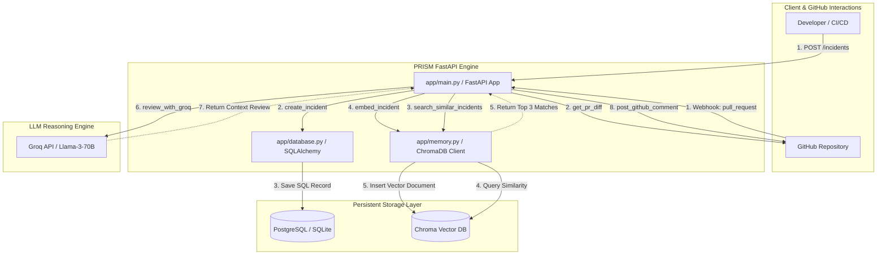

# ⚙️ PRISM: System Architecture & Data Flow

This document outlines the software design, database schemas, and data pipelines powering PRISM.

---

## 🗺️ System Architecture Diagram

The diagram below details how data flows through the PRISM server during the **Incident Logging** and **Pull Request Review** phases:



---

## 📂 Code Module Responsibilities

PRISM's codebase is designed with a strict separation of concerns:

### 1. Web Controller & Routing (`app/main.py`)
* Serves as the FastAPI entry point.
* Handles GitHub webhook triggers (`POST /webhook`) asynchronously.
* Provides the REST endpoint for logging past issues (`POST /incidents`).
* Dynamically compiles and serves the Web interface dashboard (`GET /dashboard`) using a premium Tailwind-like embedded CSS glassmorphism theme.
* Maintains a runtime state counter for reviewed PRs.

### 2. Relational Database Handler (`app/database.py`)
* Configures SQLAlchemy database connections.
* Implements dynamic connection management: auto-connects to a production PostgreSQL database via `DATABASE_URL` or falls back to local SQLite (`prism.db`) if not configured.
* Defines the SQL model representing the structured incident schema.
* Handles write transactions (`create_incident`) and read queries (`get_all_incidents`).

### 3. Vector Database Handler (`app/memory.py`)
* Coordinates connection to a local, persistent vector store inside `./chroma_db` using **ChromaDB**.
* Formats unstructured incident reports into combined semantic text strings.
* Embeds documents and indices them under their database-generated SQL IDs.
* Executes semantic vector queries (`search_similar_incidents`) using incoming code diffs as the search query.

---

## 🗄️ Database Schemas

### 1. Relational Schema (`incidents` Table)

This table stores structured metadata for auditing, dashboards, and operational metrics.

| Column Name | Data Type | Key / Constraint | Description |
| :--- | :--- | :--- | :--- |
| **id** | Integer | Primary Key (Auto-Increment) | Unique identification number |
| **title** | Text | Not Null | Short summary of the bug (e.g. "Idempotency Bug") |
| **severity** | String(50) | Not Null | Bug severity: `low` / `medium` / `high` / `critical` |
| **root_cause**| Text | Nullable | Deep technical explanation of why the bug occurred |
| **fix** | Text | Nullable | Detailed description of the code correction |
| **postmortem**| Text | Nullable | Internal postmortem URL reference |
| **affected_components** | Text | Nullable | Service or folder name affected |
| **created_at**| DateTime | Default: UTC Now | ISO Timestamp when the incident was registered |

### 2. Vector DB Document Schema (ChromaDB)

To capture semantic similarity, metadata fields are pre-processed and formatted into a unified document structure before embedding:

```text
Title: {title}
Root Cause: {root_cause}
Fix: {fix}
Postmortem: {postmortem}
```
* **Chroma ID:** Saved using the corresponding SQL incident `id`.
* **Embedding Model:** ChromaDB's built-in SentenceTransformers default.

---

## ⚡ Asynchronous Pipeline Design

To handle multiple high-frequency webhook events from active repositories without throttling or time-outs:

1. **Non-Blocking I/O:** The entire web layer relies on Python's `async`/`await` syntax.
2. **FastAPI Webhook Design:** The `/webhook` endpoint returns a HTTP `200 OK` status immediately after spawning background analysis. This prevents GitHub from marking the webhook as failed if the LLM request takes a few seconds.
3. **Async HTTP Clients:** Uses `httpx.AsyncClient` for all outbound API communication (fetching raw unified diffs from GitHub and posting comments back).
